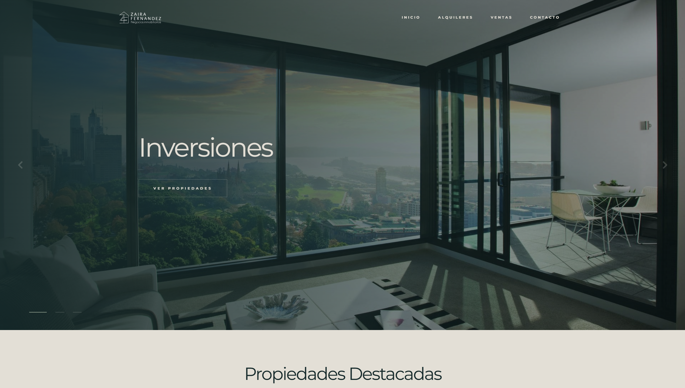
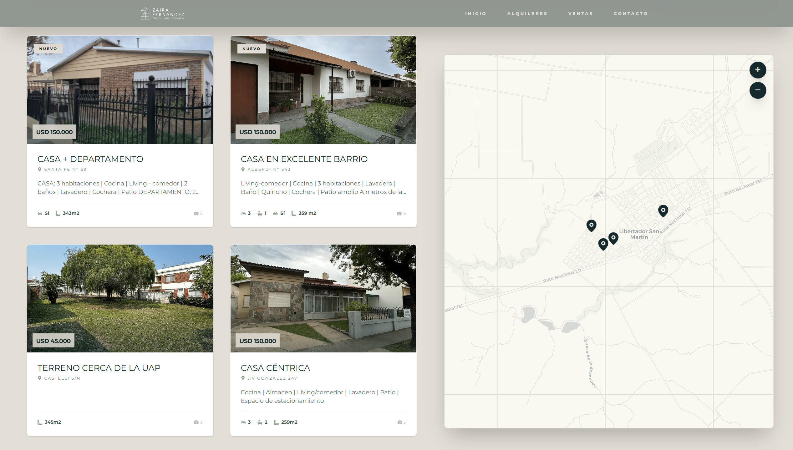
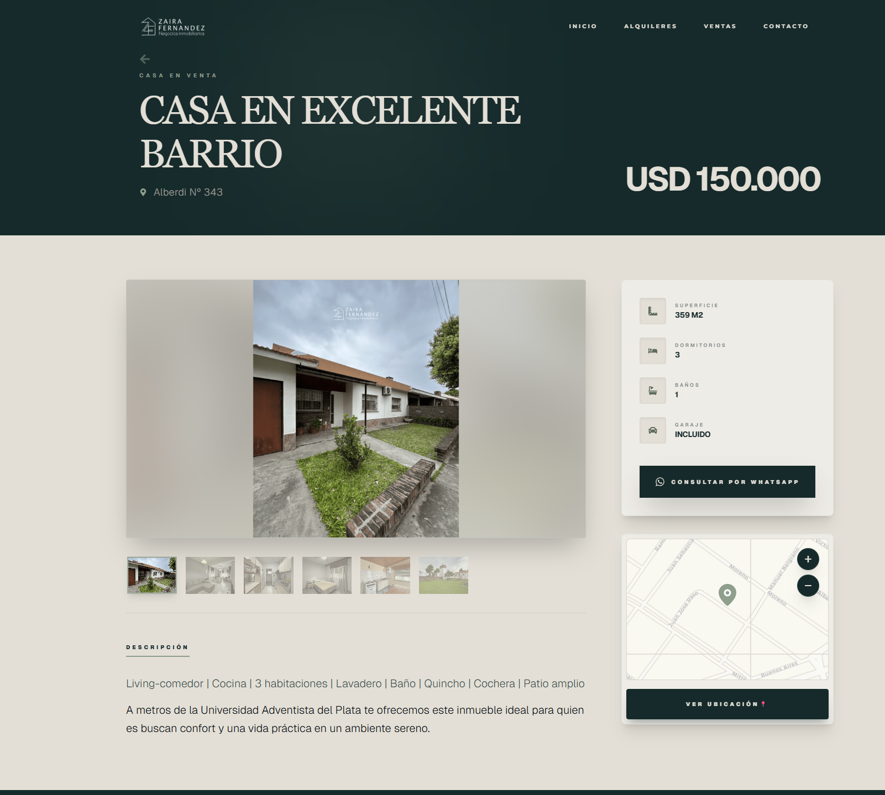
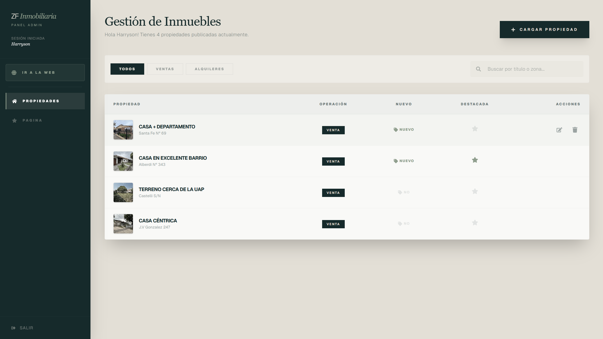
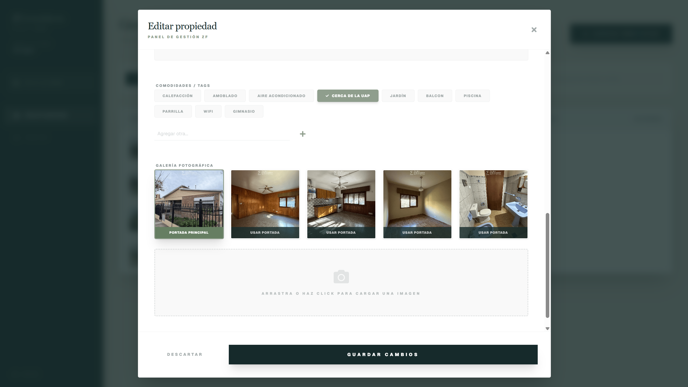
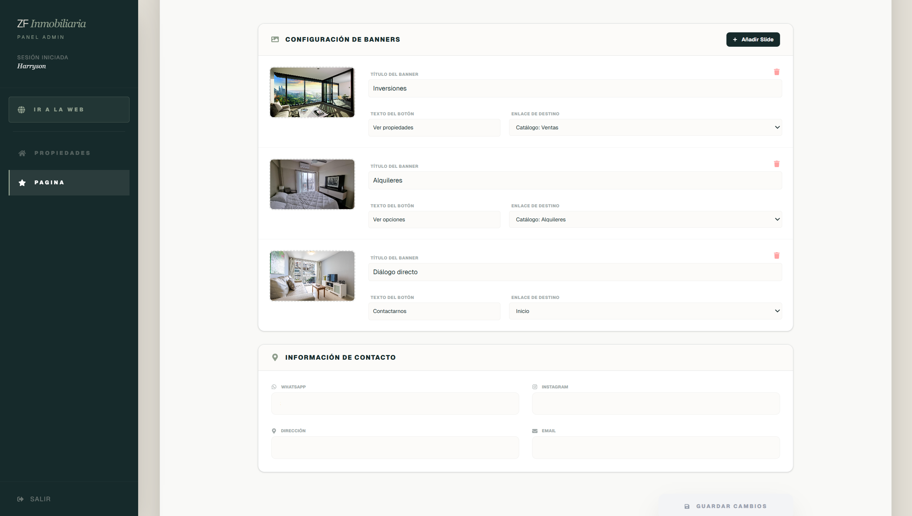

# 🏠 Real Estate Management System (Full-Stack)

Real estate platform developed for a client, featuring a custom administration suite, interactive mapping, and a decoupled architecture using Next.js and Strapi.

> **Note:** The source code is private. This repository serves as a technical case study of the architecture, integrations, and features implemented.

---

## 🔗 Live Project
* **Website:** [www.zfinmobiliaria.com](https://www.zfinmobiliaria.com/) 
* **Frontend:** Deployed on Vercel
* **Backend:** Deployed on Railway
* **Database & Storage:** Supabase (PostgreSQL)

---

## 📸 Visual Showcase

### User Experience
**Home Page & Featured Content**

**Interactive Maps & Property Details**

### Custom Administration Panel
**Management Dashboard & Content Control**

---

## Technical Highlights

* **Custom Admin CMS:** Beyond standard Headless CMS usage, I developed a specialized administrative panel in Next.js. This allows the owner to modify global site settings (Hero carousels, contact info, social media links) that propagate instantly across the entire platform.

* **Dynamic Interactive Maps:** Integrated **Leaflet** to provide real-time property locations. The system filters properties by transaction type (Sale/Rent) and updates the map markers dynamically.

* **Infrastructure & Automation**
  * **Automated Maintenance:** Implemented a **GitHub Action** "keep-alive" workflow to ensure database availability on free-tier plans.
  * **Advanced Security:** Configured **Row Level Security (RLS)** in Supabase to restrict data access exclusively to the Strapi middleware.
  * **Performance:** Client-side image compression optimizes property uploads before reaching cloud storage.

* **Bot Protection & Security:** Integrated Cloudflare Turnstile into contact forms to provide a seamless, CAPTCHA-free experience for users while effectively blocking automated spam and bot submissions.

---

## 🛠️ Tech Stack

### Frontend
* **Framework:** Next.js 16 (App Router) & TypeScript 5
* **State Management:** Zustand
* **Data Fetching:** TanStack Query (React Query) 
* **Styling:** Tailwind CSS 4 & Lucide React
* **Notifications:** Sonner & React Hot Toast

### Backend & DevOps
* **CMS:** Strapi v5 (Headless CMS)
* **Database:** PostgreSQL (Supabase)
* **Storage:** Supabase Storage (S3 Provider)
* **Email Service:** Resend API
* **DNS & Security:** Cloudflare (Turnstile & WAF) + Hostinger

---

## ✨ Key Features

### Client Experience
* **Direct Lead Generation:** Integrated contact forms via **Resend** with automated HTML email replies for both admin and users.
* **WhatsApp Integration:** Single-click contact buttons that automatically include the specific property URL and custom messages.
* **Real-time Filters:** Search by category (Sale/Rent), price, and featured status.

### Administrative Suite
* **Property Management:** Custom forms for creating and editing properties, including the ability to tag them as **"New"** or **"Featured"** to highlight them on the main landing page.
* **Global Content Manager:** Dedicated section to update home-page messages, carousels, and contact details (WhatsApp, social media, address) without code intervention.
* **Secure Auth:** Protected routes with JWT authentication and role-based access.
* **Smart Visibility Logic:** Properties marked as Sold/Rented are automatically removed from interactive maps, moved to the end of the listings, and their detail pages are updated to block inquiries.

---

## 📐 Project Architecture
The system is built on a **Decoupled Full-Stack** model:
1.  **Frontend (Next.js):** Consumes the REST API and handles SEO-optimized rendering.
2.  **Backend (Strapi):** Acts as the central data hub and manages media uploads.
3.  **Database Layer (Supabase):** Stores relational data with strict RLS policies.
4.  **Middleware:** Cloudflare manages the DNS and adds an extra layer of security.

---

© ZF Inmobiliaria – Project showcased for portfolio purposes.
